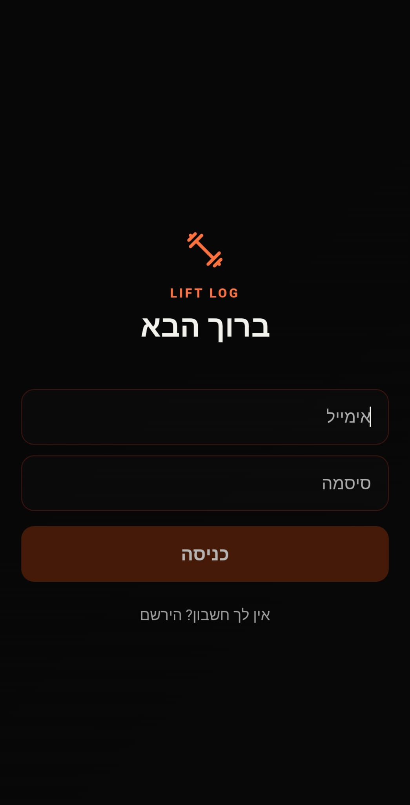
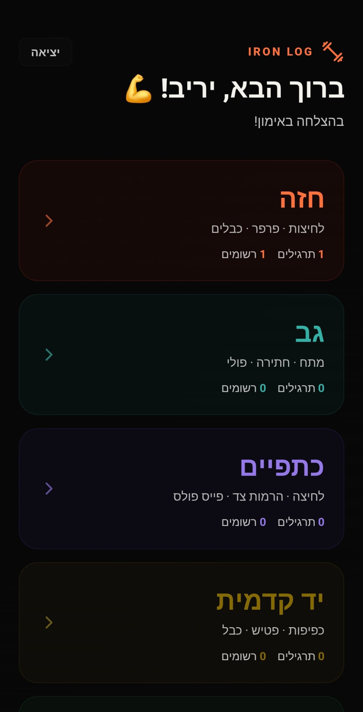
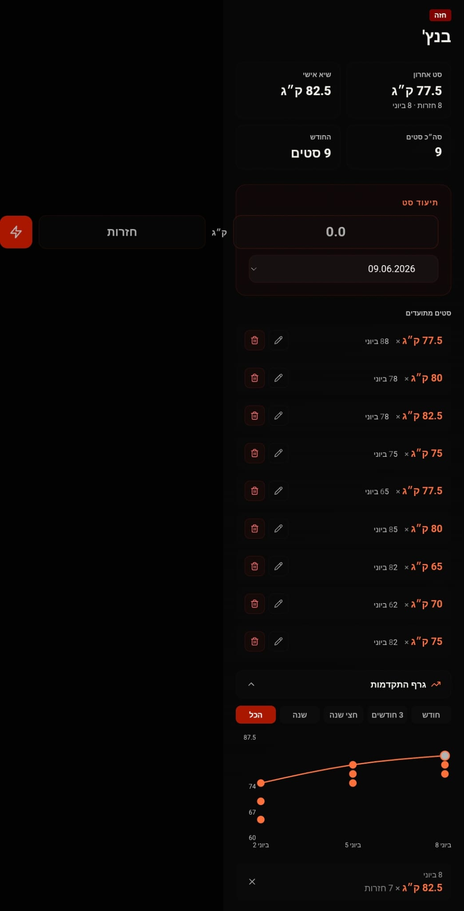

# 🏋️ LiftLog 
> A mobile-first workout tracker with real-time multi-device sync and Hebrew RTL UI

[](https://hebrew-workout-tracker.vercel.app)
[](https://nextjs.org)
[](https://supabase.com)

---
## 📸 Screenshots

| | | | |
|---|---|---|---|
|  |  |  |  |

## ✨ Features

- **Real-time sync** — changes appear instantly across all open devices via Supabase subscriptions
- **SMS OTP auth** — originally built with Twilio for phone-based one-time password login; migrated to password auth to reduce costs
- **Peak weight trend line** — Recharts ComposedChart shows daily peaks as a trend line with per-set scatter dots on the same axis
- **Rest timer** — circular progress indicator counts down between sets
- **Hebrew RTL UI** — fully right-to-left layout with dark mode throughout

---

## 🛠 Tech Stack

| Layer | Technology |
|---|---|
| Frontend | Next.js 14, React, Recharts |
| Backend | Supabase (PostgreSQL + Realtime) |
| Auth | Supabase Auth (password-based) |
| SMS OTP (prev.) | Twilio — migrated to password auth to reduce costs |
| Deployment | Vercel |

---

## 🗂 Architecture

```
/
├── src/
│   ├── app/              # Next.js App Router — pages and layouts
│   ├── components/       # Reusable UI components (Timer, Chart, SetRow…)
│   ├── hooks/            # Custom React hooks (useWorkout, useTimer…)
│   └── lib/              # Supabase client, helper utilities
└── supabase/
    └── schema.sql        # Database schema
```

## 🚀 Running Locally

```bash
git clone https://github.com/Yariv-Bar-Or/Workout
cd Workout
npm install

# Create a .env.local file with your Supabase credentials:
# NEXT_PUBLIC_SUPABASE_URL=...
# NEXT_PUBLIC_SUPABASE_ANON_KEY=...

npm run dev
```

Open [http://localhost:3000](http://localhost:3000) or visit the [Live App](https://hebrew-workout-tracker.vercel.app).

---

## 🧠 What I Learned

The hardest part was making the Recharts `ComposedChart` show all sets as scatter dots on the same vertical axis while keeping the trend line connecting only daily peaks — without the line zigzagging between individual sets. Solving that required separating the data series into two arrays with different shapes and letting Recharts render them as independent layers on the same chart.

Building real-time sync with Supabase subscriptions taught me how to manage stale state: when a remote change arrives via WebSocket, React's local state might already be ahead of it, so the subscription handler needs to merge rather than replace. I also ran into a subtle RTL layout bug in CSS Flexbox where `row-reverse` and `direction: rtl` interact unexpectedly — the fix was to keep the DOM order consistent and rely on `direction` alone to mirror the layout.

---

## 📄 License

MIT
